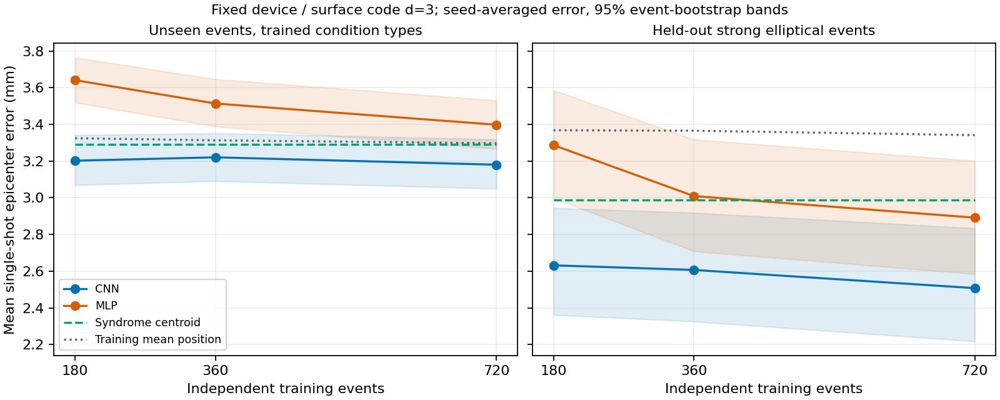

# 時間CNNの実装・学習量比較（2026-09-08）

## 結論

準備・実装・初回実験を完了しました。独立イベント1,440件、各2ショットの計2,880ショットを生成し、CNNとMLPを学習量180/360/720件・3seedで計18回訓練しました。

検証データで選ばれたのは720件学習の時間CNNです。今回の通常テストでは、3seed平均の距離誤差が **3.180 mm** で、MLPの3.398 mm、重心法の3.292 mmより低い値でした。ただし改善幅は小さく、弱・中強度では一定座標を返す基準を超えていません。高精度な位置推定が完成したとは言えません。

## 完了した準備・実装

- 学習量を増やしても検証・テストを変えない固定分割を実装。同じイベントのショットは分割をまたぎません。
- 大きい学習集合が小さい集合を含むようにし、各学習量で条件分布を揃えました。
- 「楕円形かつ最大強度帯」の組合せを学習・検証から除いたテストを追加しました。
- 新しい大きなデータセットへ拡張しても、元の評価イベントと観測乱数条件を引き継ぐ機能を追加しました。
- データ生成をプロセス並列化。並列数・分割サイズを変えても生成ビットが一致することをテストしました。
- 生の二値時系列を入力する時間CNN、保存・再読込、正解ラベルを使わない推論を実装しました。
- 学習データだけによる正規化、検証によるepoch選択、全学習完了後のテスト評価、イベント単位のbootstrapを実装しました。

## 生成条件

符号は距離3の rotated surface-code memory-Z、データ9・補助8量子ビット、X/Z両検出器です。1 µs/round、1,024ラウンド。放射線対象はdata/ancilla両方で、機器の基準T1/T2・配置は固定しています。発生時刻は0.05〜0.65 msに広げました。

円形/楕円形 × ballistic/diffusive × 内部/境界/外部 × 強度3帯域の36区分を各40イベント生成しました。区分内では位置、軸比・角度、速度/拡散係数、lambda・最大距離、強度、発生時刻、寿命などを変えています。

| パラメータ | 今回生成された範囲（概数） |
|---|---|
| 軸比 | 1.0〜2.49 |
| 向き | 0.18〜179.95度 |
| ballistic速度 | 12.0〜40.0 m/s |
| diffusion coefficient | 5.03〜19.99 mm²/ms |
| initial lambda | 2.00〜3.80 mm |
| maximum lambda | 3.51〜6.50 mm |
| maximum distance | 5.00〜10.00 mm |
| QP生成率 | 1.01e-10〜2.99e-7 /µs |
| 発生時刻 | 0.050〜0.649 ms |
| source lifetime | 1.25〜96.3 ms |

寿命などを変えても1.024 ms窓で回復全体を観測できるわけではありません。遅い発生や外部発生では、影響が十分到達しないケースも含みます。

生成は約20分、学習18回の訓練ループ合計は25.8秒でした（前処理・評価を除く）。生成データは約4.49 MB、入力・特徴量キャッシュは約28.0 MBです。大規模化では、今回の構成だとモデル訓練よりシミュレーション生成が主な時間負担になります。

## 分割と公平性

学習候補720イベント、検証240、通常テスト240、未学習組合せテスト48、除外条件のため不使用192です。すべて独立イベント単位です。最大学習集合は720イベント＝1,440個の単一ショット入力であり、生成した全2,880ショットを学習に使ったわけではありません。

真の座標は教師信号、真の物理パラメータは層別・診断用です。真の発生時刻・強度・T1などをモデルに入力したり、発生時刻で入力を整列させたりしていません。

各モデル・学習量でseed 41/42/43を使い、最大40epoch、8epoch改善なしで停止。検証平均距離誤差が最小のepochを採用しました。モデル種類・学習量は3seed平均の検証誤差で選び、テストはその後に計算しています。代表モデルのseedは事前に最初の41と決めており、テストで良いseedを選んでいません。

CNNは68,530パラメータ。各チェックで共通の時間畳み込み3層を使い、位置順に結合した全結合層で2座標へ回帰します。MLPは従来と同じ128/64ユニットと16ビンの特徴量です。モデルと入力表現の両方が違うので、差をCNN構造だけの効果とは解釈しません。

## 学習量比較

下表は3seedの**誤差の平均**で、予測座標を平均したアンサンブルではありません。

| 独立学習イベント数 | CNN・通常 | MLP・通常 | CNN・未学習組合せ | MLP・未学習組合せ |
|---:|---:|---:|---:|---:|
| 180 | 3.202 mm | 3.641 mm | 2.632 mm | 3.287 mm |
| 360 | 3.221 mm | 3.514 mm | 2.607 mm | 3.009 mm |
| 720 | 3.180 mm | 3.398 mm | 2.507 mm | 2.892 mm |

重心法は通常3.292 mm、未学習組合せ2.989 mmです。720件学習の座標平均を常に返す基準は通常3.297 mm、未学習組合せ3.341 mmです。

720件CNNの詳しい結果：

| 指標 | 通常テスト | 未学習組合せテスト |
|---|---:|---:|
| 独立テストイベント | 240 | 48 |
| 平均距離誤差 | 3.180 mm | 2.507 mm |
| 平均誤差の95%区間 | 3.049〜3.318 mm | 2.217〜2.834 mm |
| 中央値 | 3.323 mm | 2.474 mm |
| 90パーセンタイル | 4.496 mm | 4.101 mm |
| 1 mm以内 | 4.8% | 8.3% |
| 2 mm以内 | 16.2% | 36.5% |

区間はイベント単位のbootstrapで、同じイベントのショット・学習seedはまとめています。訓練済みモデルに条件付けた評価集合の不確かさであり、実機精度や個々の予測の信頼領域ではありません。

通常テストで180→720件と増やしたCNNの誤差差は −0.022 mm、対応付き95%区間は −0.066〜+0.023 mmでした。**この範囲では、学習量を増やすだけで通常テストが明確に改善したとは言えません。** 未学習組合せでは −0.124 mm、区間 −0.218〜−0.025 mmでした。

720件CNNと重心法の差の95%区間は、通常 −0.206〜−0.009 mm、未学習組合せ −0.664〜−0.287 mmです。今回の試験内では改善の兆候がありますが、多数の条件を探索した結果として慎重に解釈します。

未学習組合せの方が低誤差なのは、そこが**強いイベントだけの集合**だからです。未知条件の方が一般に簡単、あるいは汎化による劣化がないという証拠ではありません。同じ組合せを学習に含めた対照実験は今回行っていません。

## 失敗しやすい条件

通常テストの720件CNNを強度別に見ると：

| 強度帯 | CNN | 一定座標の基準 |
|---|---:|---:|
| 低：1e-10〜1e-9 /µs | 3.391 mm | 3.343 mm |
| 中：1e-9〜1e-8 /µs | 3.276 mm | 3.219 mm |
| 高：1e-8〜3e-7 /µs（通常テストでは円形のみ） | 2.566 mm | 3.362 mm |

弱・中強度で十分な位置情報を抽出できていません。これだけで物理的に位置推定が不可能とは証明できず、観測情報量・モデル・訓練方法のどれが主因かは切り分けが必要です。

通常テストの内部/境界/外部では、それぞれ2.332/3.391/3.817 mmです。外部発生は特に難しい状態です。

診断上、1.0 ms窓の平均検出器発火率は低/中/高強度で約2.91/2.98/4.47%。高強度帯の最小T1の中央値は18.3 µsで、Pauli近似の実機適合性に懸念がある条件を含みます。強い合成信号での成績を、実機の放射線イベント精度とは呼べません。

## 保存モデルと使い方

検証で選んだ代表CNNは [experiment/cnn_n720_seed41](experiment/cnn_n720_seed41) です。この**単一モデル**の通常/未学習組合せの平均誤差は3.209/2.557 mmで、上表の3seed平均とは区別してください。

このモデルを使い、正解CSVを渡さずにNPZから72ショットの座標を出す動作確認も完了しています：[prediction_smoke.csv](prediction_smoke.csv)。これは既存データの推論確認で、追加の未知評価ではありません。

- [再現コマンド・実装の詳細](../../radiation_propagation_toolkit/docs/TEMPORAL_LOCALIZATION_JA.md)
- [固定分割](split_plan.json)
- [生成設定・ハッシュ](dataset/dataset_manifest.json)
- [学習設定・ライブラリバージョン](experiment/experiment.json)
- [検証結果](experiment/validation_runs.csv)、[モデル選択](experiment/selected_model.json)
- [全テスト予測](experiment/test_predictions.csv)、[条件別集計](experiment/metrics.json)
- [観測窓・強度診断](audit/audit_summary.json)

自動テストは40件通過。既存のデータ・モデルは変更していません。CNN用にローカル仮想環境へCPU版PyTorch 2.14.0を追加しました。

## 次の判断

CNNを比較基準として保存できましたが、すぐに同じ分布で何十万件へ増やせば解決するとは判断しません。優先するのは、弱いイベントと外部発生について、観測窓の延長・背景変動の扱い・予測の曖昧さを表す出力を検証することです。GNNへの変更が必須という結果でもありません。

今回のテスト結果を見て設計を変える次の実験では、今回のテストは開発用の既知評価として扱い、最終確認に新しい未使用評価集合を用意してください。無イベント検出、複数発生源、GNN、混合分布出力、別デバイス・BB codeへの対応は未実装です。
