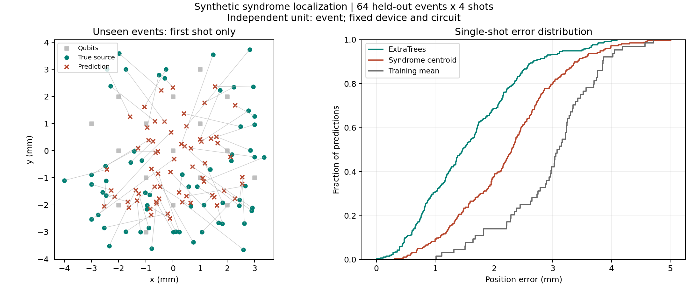

# シンドローム→エピセンター 初回実行結果

実行日: 2026-09-06。

Stimの二値検出器イベントを入力し、1ショットごとに連続座標 `(x_mm, y_mm)` を出すExtraTreesモデルを学習した。真のT1/T2、QP密度、イベント発生時刻、伝播則は推論入力に使っていない。

## データと分割

- 生成seed: 20260906、Stim seed: 20260907、分割・学習seed: 42。
- 320イベント、1イベント4ショット、1,024ラウンド、1ラウンド1 µs。
- distance-3、17量子ビット、8,192検出器/ショット。
- 円形155件・楕円165件。ballistic155件・diffusive165件。
- 内部225件・境界62件・外部33件。位置・形状・速度/拡散・範囲・強度を変化させた。
- 元イベント単位でtrain192件、validation64件、test64件。同じイベントのショットは集合をまたがない。
- 16時間区間、384特徴量、256本の木。validationで選んだmin_samples_leafは1。

## 未学習イベントの結果

独立なイベント64件、1ショットごとの予測256件で評価。ショット間平均は取っていない。

| 方法 | 平均誤差 | 中央値 | 90パーセンタイル |
|---|---:|---:|---:|
| 学習モデル | 1.583 mm | 1.468 mm | 2.666 mm |
| シンドローム重心 | 2.265 mm | 2.302 mm | 3.398 mm |
| 学習位置の平均を常に返す | 2.987 mm | 3.097 mm | 3.854 mm |

学習モデルの1 mm以内は30.9%、2 mm以内は68.8%。領域別の平均誤差は内部1.280 mm（42イベント）、境界1.882 mm（13イベント）、外部2.563 mm（9イベント）。円形1.377 mm、楕円1.699 mm。

## 保存物

- [学習済みモデル](model/model.joblib)
- [全評価指標・ハッシュ・バージョン](model/metrics.json)
- [testの正解・推定・誤差](model/test_predictions.csv)
- [元イベントの分割](model/splits.json)
- [正解情報を除去した1ショット入力](single_shot_input.npz)
- [その推論結果](single_shot_prediction.csv)

1ショット例はtestの元イベント0、shot0を使用した。正解情報を含まないNPZから推論して `x=2.543272 mm, y=-1.214211 mm` を得た。保存済みtest評価の予測と一致することを確認した。正解は `(2.449756, -1.812887) mm`。

コードの同梱テストと追加テストは合計22件通過。主にイベント単位の分割、境界を除外した発火率集計、真値の不使用、配置・時間設定の不一致拒否、control除外、保存後の推論、単純な別生成器に対する未学習位置の回収を確認した。

## 解釈と次の課題

これは同一の合成器・機器・回路内での初期ベースラインであり、実機検証や未知機器への汎化評価ではない。単一イベントを含む切り出し済み観測窓が前提。イベントの有無判定、複数発生源、位置の信頼領域は未実装。

このサンプルでは320件中295件でイベント内最小T1が30 µs未満になった。強いT1低下に対するStimのPauli近似の制約を引き継ぐため、ここでの位置誤差を実機性能へ読み替えない。次の実験では観測時間・強度分布・外部領域のサンプル数を検討し、新たなtest集合を用意して改善を評価する。今回のtestを見て選んだ改良を、同じtestに対する独立検証とは扱わない。

実行方法・入力仕様は [LOCALIZATION_JA.md](../../radiation_propagation_toolkit/docs/LOCALIZATION_JA.md) を参照。
