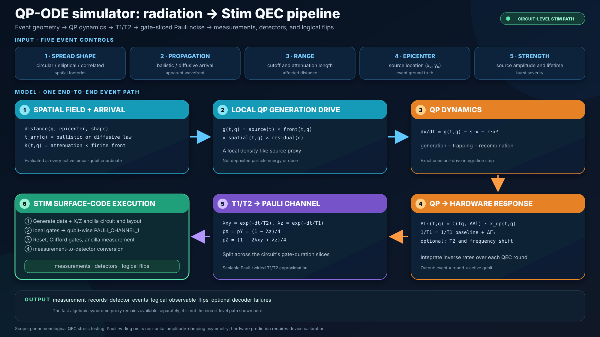

# QP-ODE Simulator Toolkit

A standalone toolkit for generating phenomenological radiation events in
superconducting-qubit layouts and propagating their quasiparticle-induced
`T1/T2` changes into QEC circuit data.



The toolkit was extracted from an experiment repository so that the reusable model,
configuration, QEC pipeline, tests, and documentation are separate from data analysis
notebooks and generated figures. It does **not** require the Google dataset.

## What it provides

1. A five-axis event generator: shape, apparent propagation, range, epicenter, and strength.
2. A local quasiparticle ODE at every active qubit coordinate.
3. Time- and qubit-dependent `T1`, `T2`, optional frequency shift, and response probability.
4. A circuit-level Stim path that produces measurements, detectors, logical flips, and
   optional PyMatching decoding.
5. A lightweight algebraic syndrome proxy for fast exploratory work.
6. Exact generalized-amplitude-damping versus Pauli-twirled channel validation.

## Model in one view

For qubit `q`, the spatial/wavefront model defines the local source proxy `g(t,q)`.
The simulator solves

```text
dx_qp(t,q)/dt = g(t,q) - s*x_qp(t,q) - r*x_qp(t,q)^2
```

and converts the normalized QP density to relaxation:

```text
Delta_Gamma1(t,q) = C(f_q, Delta_Al) * x_qp(t,q)
1/T1(t,q) = 1/T1_baseline(q) + Delta_Gamma1(t,q)
```

For a circuit interval `dt`, the Stim path uses the Pauli-twirled `T1/T2` channel:

```text
lambda_xy = exp(-dt/T2)
lambda_z  = exp(-dt/T1)
pX = pY = (1 - lambda_z)/4
pZ = (1 - 2*lambda_xy + lambda_z)/4
```

These channels are inserted into the generated QEC circuit between gate moments. Stim
then performs ancilla reset, Clifford gates, measurement, detector comparison, and
logical-observable bookkeeping.

## Installation

```bash
cd /home/rui/Downloads/qp_ode_simulator_toolkit
python3 -m venv .venv
source .venv/bin/activate
python3 -m pip install -e '.[all]'
```

Core field generation only needs NumPy, Pandas, and SciPy:

```bash
python3 -m pip install -e .
```

## Quick start

Generate two events on the neutral 5-by-5 default layout:

```bash
qp-ode-simulate --n-events 2 --output qp_ode_output
```

Use a custom layout (`x_mm,y_mm`):

```bash
qp-ode-simulate \
  --coords examples/custom_layout.csv \
  --n-events 2 \
  --output custom_layout_output
```

Run a small, natural QEC circuit example:

```bash
qp-ode-stim \
  --n-events 2 \
  --stim-config examples/stim_smoke.json \
  --output qp_ode_stim_output
```

Run the full bundled distance-3 reference configuration by omitting
`--stim-config`. It uses 2048 rounds and 32 shots per event.

Validate the fast Stim channel approximation:

```bash
qp-ode-validate-channel --output channel_validation_output
```

Validate recovery of the configured propagation parameters:

```bash
qp-ode-validate-propagation --output propagation_validation_output
```

This plotting command needs the `plot` or `all` optional dependency.

## Propagation self-consistency benchmark

The bundled seeded benchmark generates 60 ballistic and 60 diffusive fields on a
9-by-9 layout. It adds 30 us RMS arrival jitter and 0.1 log-SD qubit-response scatter,
then fits the wavefront without giving the estimator the epicenter, onset, speed, or
diffusion coefficient. The tested ranges are 12--40 m/s, 5--20 mm2/ms, and a 2--6.5 mm
radial scale.

| Recovery metric | Ballistic | Diffusive |
|---|---:|---:|
| Propagation-parameter MAPE | 7.8% | 0.7% |
| Propagation-parameter R2 | 0.805 | 0.999 |
| Radial-scale MAPE | 3.2% | 2.3% |
| Median epicenter error | 0.155 mm | 0.012 mm |
| 90th-percentile epicenter error | 0.362 mm | 0.024 mm |


This result shows that the implementation preserves its configured wavefront and
attenuation parameters under controlled nuisance variation. It is a latent-field
self-consistency test without binary shot noise; it does **not** show that these laws
or parameter ranges match radiation transport in hardware. See
[docs/VALIDATION.md](docs/VALIDATION.md) for the method, panel-by-panel interpretation,
and claim boundary.

## Google hardware-data comparison

The same simulator core was also evaluated against the measured RReCS data released
with [McEwen et al.](https://doi.org/10.1038/s41567-021-01432-8). This is real
Sycamore-family qubit relaxation data, **not** surface-code syndrome data. The
Google-calibrated QP-ODE profile used 206 strong events from 60 MAIN recordings for
distribution-level calibration. The table below uses 53 events from 16
recording-separated test recordings; those recordings were excluded from QP tuning,
although they had been inspected during earlier profile development.

| Measured-data check | Result | Interpretation |
|---|---:|---|
| MAIN absolute temporal response inside simulation 95% region | 49/53 (92.5%) | broad agreement |
| MAIN absolute nearest-event RMSE | 0.0365 error fraction | close to empirical 0.0361 |
| MAIN normalized decay shape inside simulation 95% region | 48/53 (90.6%) | broad agreement |
| MAIN normalized-shape nearest RMSE | 0.1510 | slightly worse than empirical 0.1470 |
| FAST apparent speed / arrival shape inside 95% region | 15/15 / 15/15 | tentative: only 3 unique events x 5 seeds |
| FAST rise width inside 95% region | 10/15 | one event pattern remains difficult |
| FAST-to-MAIN zero-shot spatial map / pairwise coverage | 26/53 / 35/53 | weak spatial transfer |


FAST is evaluated separately because its 3 us sampling resolves the initial response
expansion that MAIN's 100 us sampling cannot. The figure below compares all three FAST
hardware events with 256 simulations. It is an **in-sample posterior-predictive check**:
the simulation ranges were chosen after inspecting these same three events. The table's
15/15 wavefront rows instead come from leave-one-event-out selection repeated over five
simulation seeds, but still represent only three unique measured events.


The defensible conclusion is therefore **moderate same-device temporal consistency,
tentative wavefront support, and insufficient zero-shot spatial generalization**. The
QP-ODE backend does not beat the empirical temporal backend here: its decay-time
Wasserstein distance is 4.95 ms versus 2.00 ms. MAIN is sampled every 100 us and cannot
resolve fine wavefront speed; FAST has only three events. The 27-channel MAIN release
also has only 26 published coordinates, so the spatial result depends on an explicit
channel-mapping assumption.

Raw Google archives are not redistributed or required at runtime. Exact archive hashes,
recording splits, result-table hashes, and machine-readable metrics are in the
[validation summary](docs/validation/google_hardware_validation_summary.json); detailed
method and claim limits are in [docs/VALIDATION.md](docs/VALIDATION.md).

## Python API

```python
from qp_ode_simulator import (
    load_default_simulator_config,
    rectangular_layout,
    run_simulation,
)

config = load_default_simulator_config()
config["n_events"] = 4
coords = rectangular_layout(4, 6, pitch_mm=0.8)

result = run_simulation(config, coords_mm=coords)
result.save("my_dataset")

print(result.physics["x_qp"].shape)
print(result.physics["t1_us"].shape)
print(result.parameters[["epicenter_row", "epicenter_col"]])
```

See [examples/python_api.py](examples/python_api.py) for a short runnable example.

## Package structure

```text
src/qp_ode_simulator/
  simulator.py          event geometry, wavefront, QP ODE, T1/T2
  layouts.py            arbitrary coordinate layouts
  syndrome.py           fast algebraic syndrome proxy
  stim_qec.py            circuit-level Stim implementation
  channel_validation.py exact-GAD/PTGAD validation
  propagation_validation.py synthetic wavefront parameter recovery
  api.py                 stable result objects and end-to-end API
  cli/                   command-line entry points
  configs/               versioned default configurations
examples/                minimal custom-layout and QEC examples
tests/                   standalone regression and integration tests
docs/                    architecture, limitations, and validation evidence
```

## Main outputs

`qp-ode-simulate` writes:

- `simulated_events.npz`: observations, probabilities, coordinates, QP density,
  source proxy, `T1/T2`, and optional phase diagnostics.
- `true_parameters.csv`: event-level ground truth for supervised learning.
- `resolved_config.json`: the exact merged configuration.

`qp-ode-stim` additionally writes:

- `stim_syndrome_events.npz`: measurements, detector events, logical flips, and
  injected Pauli-channel arrays.
- `stim_template_circuit.stim` and `stim_first_event_circuit.stim`.
- `stim_syndrome_metadata.json` and `run_manifest.json`.

## Syndrome-to-epicenter localization

`qp-ode-localize` trains a CPU baseline that maps a single shot of binary Stim
detector events to continuous `(x_mm, y_mm)` coordinates. It uses detector rates
over space/time and ExtraTrees regression, with original-event train/validation/test
splits so repeated shots cannot leak between splits. Simulator truth is excluded
from inference. Install the `localization` extra or `all`.

```bash
qp-ode-stim --profile examples/localization_simulator.json \
  --stim-config examples/localization_stim.json --output ../localization_data
qp-ode-localize train --dataset ../localization_data --output ../localization_model
qp-ode-localize predict --model ../localization_model/model.joblib \
  --input ../localization_data/stim_syndrome_events.npz --output ../epicenters.csv
```

The initial scope is a known single-event window on a fixed circuit/layout, not
event detection or hardware validation. Test errors and centroid/constant baselines
are saved separately. See [the Japanese localization guide](docs/LOCALIZATION_JA.md)
for input schemas, evaluation, controls, and limitations.

For larger runs, `qp-ode-dataset generate` writes resumable compact shards with
balanced parameter cells and independent event/device/measurement seeds.
`qp-ode-localize train` automatically uses an incremental MLP for this sharded
format. `qp-ode-dataset audit` compares observation prefixes and strength bands.
See [the dataset guide](docs/DATASET_JA.md). The bundled circuit is a rotated
distance-3 surface code; BB-code circuit generation is not implemented.

## Scientific scope

This is a **phenomenological superconducting-QEC stress-test simulator**. The source
field reproduces configurable event shapes and wavefronts, but it is not Geant4/G4CMP
and does not predict deposited particle energy, dose, material transport, or an
absolute hardware event rate. `g(t,q)` is a local density-like source proxy; summing it
over sensor qubits is not energy conservation.

The default hardware hierarchy samples one fixed device-level calibration map and
reuses it across all events. Event strength, shape, speed, range, and epicenter change;
baseline qubit hardware does not. This prevents each event from accidentally behaving
like a different QPU.

The Stim path is scalable but Pauli-twirls non-unital amplitude damping. The bundled
validation shows that this approximation becomes inaccurate for strong `T1` collapse.
Use those samples as stress-test data, not exact hardware predictions. Details are in
[docs/VALIDATION.md](docs/VALIDATION.md) and [docs/MODEL_LIMITATIONS.md](docs/MODEL_LIMITATIONS.md).

## Reproducibility and publication

- Every output stores the resolved configuration.
- The Stim pipeline stores source/config/circuit hashes and package versions.
- Random seeds are explicit and independent simulation/syndrome seeds are supported.
- Full Google-specific extraction, calibration, and model-selection code remains in the
  companion experiment repository. This toolkit checks in only the audited summary,
  provenance hashes, and publication figure; no raw Google archive is required at runtime.

No software license has been selected yet. Add an explicit license before public
redistribution or accepting external contributions.

Japanese guide: [docs/README_JA.md](docs/README_JA.md)

Paired localization study: [docs/LOCALIZATION_STUDY_JA.md](docs/LOCALIZATION_STUDY_JA.md)

Temporal CNN and frozen learning curves: [docs/TEMPORAL_LOCALIZATION_JA.md](docs/TEMPORAL_LOCALIZATION_JA.md)

Observation-window / quiet-calibration ablation: [docs/WINDOW_CALIBRATION_JA.md](docs/WINDOW_CALIBRATION_JA.md)

Temporal / onset diagnostics and adapted REI comparison: [docs/TEMPORAL_DIAGNOSIS_JA.md](docs/TEMPORAL_DIAGNOSIS_JA.md)

Segmentation, weak-signal shrinkage, and empirical templates: [docs/ADAPTIVE_LOCALIZATION_JA.md](docs/ADAPTIVE_LOCALIZATION_JA.md)

Model comparison on fixed syndrome features: [docs/MODEL_COMPARISON_JA.md](docs/MODEL_COMPARISON_JA.md)

Model references: [docs/REFERENCES.md](docs/REFERENCES.md)
