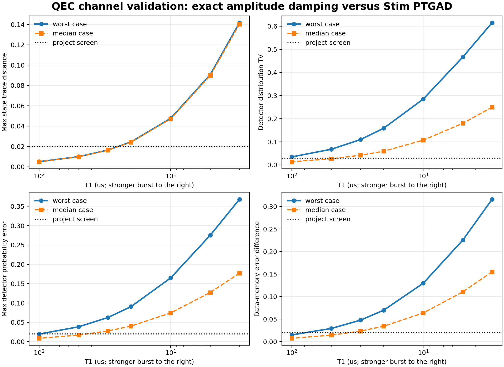
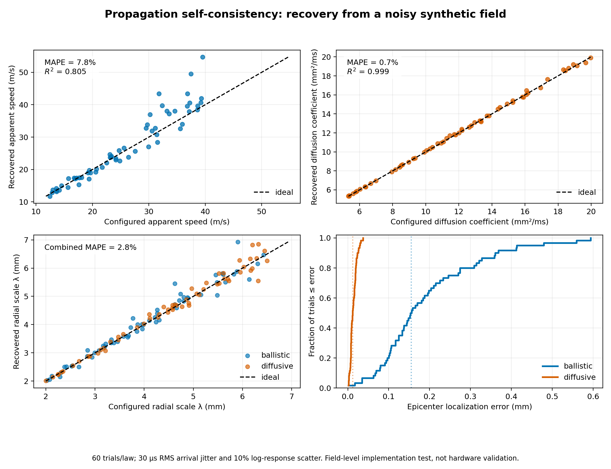
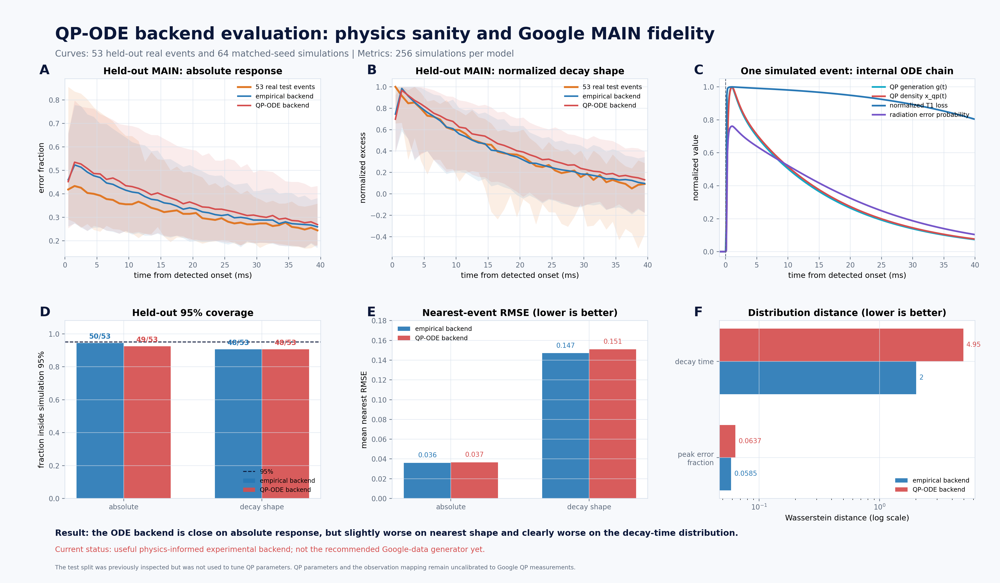
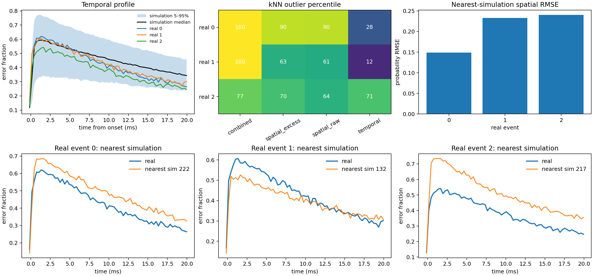

# Validation status

The reusable code has four distinct validation levels. They answer different
questions and should not be combined into a single hardware-accuracy claim.

## Software validation

The standalone tests check configuration rejection, deterministic seeding, ODE stability,
probability bounds, fixed hardware across events, arbitrary layouts, T1/T2-to-Pauli
conversion, Stim circuit construction, and output schemas.

## Channel validation

The bundled deterministic benchmark compares exact non-unital generalized amplitude
damping plus dephasing with the Pauli-twirled channel used by Stim. It enumerates every
measurement branch of a repeated three-qubit parity-check primitive, so there is no shot
noise in the comparison.

The current reference screen passes 75% of cases at `T1=100 us`, 50% at `50 us`, and
0% at `T1<=30 us` under project-specific thresholds. Worst detector-distribution total
variation is 0.0347 at 100 us, 0.1097 at 30 us, and 0.2850 at 10 us. These thresholds are
engineering screens, not universal physics tolerances.



## Propagation self-consistency validation

The seeded synthetic benchmark asks a narrow implementation question: if the
simulator is configured with a known wavefront law, radial scale, and epicenter, can a
reference fit recover those values after controlled nuisance variation is added?

For distance `d` from the unknown epicenter, the half-height arrival time obeys

```text
ballistic: t50 = t0 + d/v
diffusive: t50 = t0 + d^2/D
radial envelope: A(d) proportional to exp[-(d/lambda)^beta]
```

The fit jointly estimates the two epicenter coordinates, onset `t0`, and either `v` or
`D` from the half-height arrivals. It then estimates `lambda` from the late spatial
envelope. The estimator is not given the sampled ground-truth values.

### Reference screen

- 60 seeded trials for each propagation law on a 9-by-9, 6 mm-wide layout.
- Ballistic speed 12--40 m/s; diffusion coefficient 5--20 mm2/ms.
- Radial scale 2--6.5 mm; epicenter sampled inside the central 2.4-by-2.4 mm region.
- 30 us RMS per-qubit arrival jitter and 0.1 log-SD response scatter.
- Expected field probabilities are fitted; binary measurement shot noise is not added.

| Recovery metric | Ballistic | Diffusive |
|---|---:|---:|
| Propagation-parameter median absolute percent error | 5.1% | 0.6% |
| Propagation-parameter mean absolute percent error | 7.8% | 0.7% |
| Propagation-parameter R2 | 0.805 | 0.999 |
| Radial-scale mean absolute percent error | 3.2% | 2.3% |
| Median epicenter error | 0.155 mm | 0.012 mm |
| 90th-percentile epicenter error | 0.362 mm | 0.024 mm |
| Median arrival-fit RMSE | 28.4 us | 28.2 us |



### Figure interpretation

The upper-left panel compares configured and recovered ballistic speed. The visible
spread is expected because 30 us jitter is appreciable relative to sub-millisecond
ballistic delays; the identity trend remains, with 7.8% mean absolute error. The
upper-right panel repeats the comparison for diffusion. Its longer distance-squared
timing lever arm makes the same absolute jitter less damaging, yielding 0.7% error.

The lower-left panel pools both laws and compares configured versus recovered radial
scale. The 2.8% combined mean absolute error shows that the exponential spatial
envelope remains identifiable despite qubit-response scatter. The lower-right panel is
the cumulative distribution of epicenter error. Diffusive timing localizes more tightly
in this particular layout and time window; this is a property of this synthetic screen,
not a universal statement that diffusion is easier to localize in hardware.

### What this result does and does not establish

This benchmark supports the claim that the code implements recoverable ballistic and
diffusive wavefronts and radial attenuation under its stated nuisance model. It tests
the shared propagation layer independently of the QP-ODE response and finite-shot
syndrome sampling. It does not establish that a real burst was caused by radiation,
that these phenomenological laws describe substrate phonons, or that the default
parameter ranges are calibrated to a device.

A hardware radiation claim needs independently tagged radiation events (for example,
an external particle detector or controlled source), measured qubit coordinates and
timing, train/test separation by run or device, and comparison against non-radiation
alternatives. Useful held-out metrics would include arrival-time residuals versus
distance, epicenter error to the external tag, spatial-envelope error, event detection
precision/recall, and calibration of predicted probabilities.

Reproduce the bundled result with:

```bash
qp-ode-validate-propagation --output propagation_validation_output
```

The CSV, JSON summary, and figure checked into `docs/validation/` are generated from
`propagation_validation.json` with seed 20260901.

## Google measured-data validation

### Dataset and observable

The hardware comparison uses the data released with McEwen et al., *Resolving
catastrophic error bursts from cosmic rays in large arrays of superconducting qubits*
([DOI](https://doi.org/10.1038/s41567-021-01432-8),
[arXiv](https://arxiv.org/abs/2104.05219)). The experiment repeatedly prepares each
qubit in the excited state, waits 1 us, and records whether it relaxed. Consequently,
the observable is a binary RReCS relaxation response. It is not a surface-code syndrome
or a direct measurement of deposited particle energy.

The publisher-supplied archives used in the companion experiment contain:

- MAIN: 91 recordings, 600,000 cycles per recording, 100 us sampling, and 27 measured
  channels. A fixed detector selected 315 strong event windows.
- FAST: three recordings at 3 us sampling, used for qubit-resolved arrival timing.
- A published coordinate table for 26 qubits. The identity of MAIN's 27th channel is not
  documented.

Raw archives are not redistributed in this toolkit. Their SHA-256 values and all
derived-result hashes are recorded in
[`google_hardware_validation_summary.json`](validation/google_hardware_validation_summary.json).

### Split and model

MAIN was split by original recording rather than by extracted event: 60 recordings
(206 strong events) for calibration, 15 (56 events) for validation, and 16 (53 events)
for test. No recording occurs in more than one split. The evaluated
`google_general_spatial_v5_qp_ode` profile uses calibration-derived population and
observation-layer distributions. Its QP coefficients and Google observation mapping
were not fitted to direct QP-density measurements.

The test recordings were excluded from QP parameter tuning, but they had been inspected
during earlier profile development. They are therefore recording-separated test data,
not a never-inspected external benchmark. The profile also samples a target-peak
distribution learned from calibration data and rescales each synthetic event to its
sampled target; it never fits an individual test event's peak.

The packaged simulator calculation core is the same as the companion evaluation core.
The code differences are package-relative imports, a neutral default layout, and CLI
packaging; the Google evaluation supplies the published 26 coordinates explicitly.

### MAIN temporal results

Each model generated 256 events with seed 20260825. A real event is counted as covered
when its feature vector lies inside the simulation's empirical 95% region. Coverage must
be paired with nearest-event RMSE because an excessively broad simulator can achieve
high coverage.

| Test metric (53 real events) | Empirical backend | QP-ODE backend |
|---|---:|---:|
| Absolute response inside 95% region | 50/53 (94.3%) | 49/53 (92.5%) |
| Absolute mean nearest RMSE | 0.0361 | 0.0365 |
| Normalized shape inside 95% region | 48/53 (90.6%) | 48/53 (90.6%) |
| Normalized-shape mean nearest RMSE | 0.1470 | 0.1510 |
| Peak-fraction Wasserstein distance | 0.0585 | 0.0637 |
| Decay-time Wasserstein distance | 2.00 ms | 4.95 ms |



Panels A and B show the 5th--95th percentile bands and medians for the 53 real test
events and the matched simulations. Panel C shows the internal synthetic chain from
source proxy through QP density and T1 loss; it is not an experimental QP-density
trace. Panels D and E report coverage and nearest RMSE. Panel F shows that the QP-ODE
decay-time distribution is farther from the real distribution than the empirical
backend even though their median temporal curves are close.

### FAST wavefront and spatial transfer

The FAST analysis selected a structural candidate using two events and evaluated the
third, cycling the held-out event and repeating with five simulation seeds. Thus the 15
rows below contain only three unique hardware events and are not 15 independent
experimental observations.

| FAST feature | Inside simulation 95% region | Mean nearest RMSE |
|---|---:|---:|
| Apparent response-expansion speed | 15/15 | 0.353 m/s |
| Arrival-time shape | 15/15 | 101.2 us |
| Log rise width | 10/15 | 1.166 |

The selected sharp ballistic front is consistent with these three events, but the
candidate ranges were informed by prior inspection of them. “Apparent speed” is the
expansion of the measured qubit response, not a substrate phonon group velocity.



This six-panel figure is a complementary **in-sample posterior-predictive check** using
all three FAST events and 256 simulations:

- Upper left: each measured mean error-fraction trace is compared with the simulation
  median and 5th--95th percentile envelope. All three traces remain within the broad
  temporal envelope over most of the 20 ms window.
- Upper middle: k-nearest-neighbour outlier percentiles show where each real event lies
  in the simulated joint, spatial, and temporal feature distributions. High values mean
  an event is relatively peripheral, not that the fit is better.
- Upper right: the nearest simulated normalized spatial pattern has probability RMSE
  0.15--0.24 across the 26 qubits, so the match is visible but not exact.
- Lower row: the temporal trace of each real event is overlaid with its nearest
  simulation. Event 1 is the closest of the three; events 0 and 2 retain amplitude and
  decay mismatches.

This plot checks whether the calibrated simulator can reproduce already-inspected FAST
events. It is not an independent generalization test. The leave-one-event-out table
above is the stronger wavefront check, while remaining statistically weak because only
three unique hardware events exist.

For a harder spatial check, the frozen FAST profile was transferred to the MAIN test
events without fitting the spatial kernel to MAIN. Only 26/53 normalized maps and 35/53
pairwise-structure vectors fell inside the simulation 95% region. This result is
conditional on treating zero-based MAIN channel 26 as the undocumented extra channel.
It is evidence against claiming robust zero-shot spatial generalization.

### Claim boundary

The measured-data evidence supports moderate same-device temporal consistency. It gives
tentative support to the wavefront family but does not establish spatial generalization,
cross-device performance, microscopic phonon transport, or absolute event-rate
prediction. The Google events are identified from correlated qubit bursts rather than
an independent particle-detector coincidence, so this comparison also cannot by itself
prove the cause of an individual event.

The checked-in [CSV](validation/google_hardware_validation_summary.csv) contains all
reported rows. Full raw-data extraction and model-selection code remains in the
companion experiment repository so the runtime package stays small.
